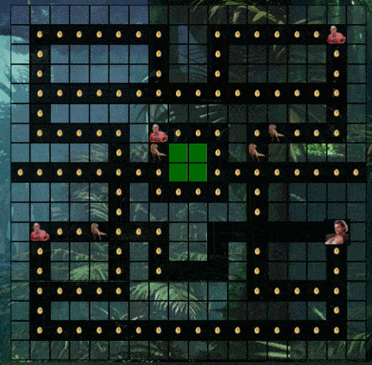

# project-1
### General Assembly, Software Engineering Immersive

## Jurassic Pac-Man

## Overview

This is my first project as part of the Software Engineering Immersive course at General Assembly London. The assignment was to create a grid-based game to be rendered in the browser, using 'vanilla' JavaScript, HTML and CSS. The project was to be completed individually within one week.

I chose to re-create the classic game Pac-Man with a Jurassic Park twist. Both are childhood classics of mine, and the story dovetailed nicely with the Pac-Man premise: our hero (Jeff Goldblum), collecting items (dinosaur eggs) while avoiding pursuit by nemeses (dinosaurs). 

You can launch the game on GitHub pages [here](https://emmahobday.github.io/project-1/), or find the GitHub repo [here](https://github.com/emmahobday/project-1).

## Brief

* Render a game in the browser
* Design logic for winning & visually display which player won
* Include separate HTML / CSS / JavaScript files
* Stick with KISS (Keep It Simple Stupid) and DRY (Don't Repeat Yourself) principles
* Use Javascript for DOM manipulation
* Deploy your game online, where the rest of the world can access it
* Use semantic markup for HTML and CSS (adhere to best practices)

## Technologies used
* HTML5
* CSS3
* JavaScript (ES6)
* Git and GitHub
* Google Fonts


## Approach

### Board layout

The game is built using an 18 x 18 square grid, created using Javascript. HTML divs are created using a 'for loop' and appended as children of the grid. 

Each div is assigned the class 'cell' and pushed to an array 'cells', which is updated with the position of each element during gameplay.

The board layout - including barriers, eggs, power-ups and the starting positions of Jeff Goldblum and all the dinosaurs - are assigned during the process by adding relevant classes to cells.  I designed the layout based on a traditional Pac-Man grid and created arrays to list the cell numbers that should contain those classes.  

```
  const cells = []
  let jeffPosition = 242
  let dinosaurOnePosition = 134
  let dinosaurTwoPosition = 135
  let dinosaurThreePosition = 153
  let dinosaurFourPosition = 152
  const barriersArray = [0, 1, 2, 3, 4, 5, 6, 7, 8, 9, 10, 11, 12, 13, 14, 15, 16, 17, 18, 26, 27, 35, 36, 38, 39, 40, 41, 42, 44, 45, 47, 48, 49, 50, 51, 53, 54, 56, 57, 58, 59, 60, 62, 63, 65, 66, 67, 68, 69, 71, 72, 89, 90, 92, 93, 94, 95, 96, 97, 98, 99, 100, 101, 102, 103, 104, 105, 107, 108, 114, 119, 125, 126, 127, 128, 129, 130, 132, 134, 135, 137, 139, 140, 141, 142, 143, 152, 153, 162, 163, 164, 165, 166, 168, 173, 175, 176, 177, 178, 179, 180, 181, 182, 183, 184, 186, 187, 188, 189, 190, 191, 193, 194, 195, 196, 197, 198, 206, 207, 215, 216, 218, 219, 220, 222, 224, 225, 227, 229, 230, 231, 233, 234, 236, 237, 238, 240, 245, 247, 248, 249, 251, 252, 258, 259, 260, 261, 262, 263, 269, 270, 272, 273, 274, 275, 276, 277, 278, 279, 280, 281, 282, 283, 284, 285, 287, 288, 305, 306, 307, 308, 309, 310, 311, 312, 313, 314, 315, 316, 317, 318, 319, 320, 321, 322, 323]
  const specialArray = [34, 115, 199, 214]
```


```
for (let i = 0; i < gridCellCount; i++) {  
    const cell = document.createElement('div')    
    cell.classList.add('cell')
    if (i === jeffPosition) {
      cell.classList.add('jeff')
    } else if (i === dinosaurOnePosition) {
      cell.classList.add('barrier')
      cell.classList.add('holdingarea')
      cell.classList.add('dinosaur1')
    } else if (i === dinosaurTwoPosition) {
      cell.classList.add('barrier')
      cell.classList.add('holdingarea')
      cell.classList.add('dinosaur2')
    } else if (i === dinosaurThreePosition) {
      cell.classList.add('barrier')
      cell.classList.add('holdingarea')
      cell.classList.add('dinosaur3')
    } else if (i === dinosaurFourPosition) {
      cell.classList.add('barrier')
      cell.classList.add('holdingarea')
      cell.classList.add('dinosaur4')
    } else if (barriersArray.includes(i)) {
      cell.classList.add('barrier')
    } else if (specialArray.includes(i)) {
      cell.classList.add('special')
    } else {
      cell.classList.add('food')
    }
    grid.appendChild(cell)
    cells.push(cell)
  }
```

The class 'food' is added to all remaining cells, which signifies the cells which contain an egg to be collected. This creates our starting layout:


  

## Navigating the board

### Jeff's movement
Jeff is moved around the board using the arrow keys. I added an event listener to the page which listens for a keydown event, and then does the following:

* removes the class 'jeff' from his current location
* reassigns the variable `jeffPosition` accordingly
* adds the class 'jeff' to his new location

Because the grid cells are numbered in ascending order, moving left to right, top to bottom, he can be moved using the following logic:

* right: `jeffPosition += 1`
* left: `jeffPosition -= 1`
* up: `jeffPosition -= width`
* down: `jeffPosition += width`


I added some conditions to this code whereby Jeff cannot be moved. `gameEnding` is a variable set initially as 'false', which is reassigned as 'true' if you win the game or are caught by a dinosaur. `youWon` is a variable set initially as 'false', which is reassigned as 'true' if you complete the level successfully. If either of these variables are set to true, Jeff cannot be moved. 

Otherwise, depending on the key pressed, Jeff is moved. This movement needed to take into account a number of things to ensure he obeys the rules of the board. Firstly, the 'tunnel' that joins the right-center and left-center of the board needed to be hard-coded - in the example below, if the right-arrow key is pressed and Jeff's position is cell 161 (the right-center cell), his position should be reassigned to cell 143 (the left-center cell).


```
const width = 18

document.addEventListener('keydown', (event) => {
    if (gameEnding || youWon) {
      return
    }
    if (event.key === 'ArrowRight') {
      if (jeffPosition === 161) {
        cells[jeffPosition].classList.remove('jeff')
        jeffPosition = 143
        cells[jeffPosition].classList.add('jeff')
      } else if (jeffPosition === cells.length - 1 || jeffPosition % width === width - 1 || cells[jeffPosition + 1].classList.contains('barrier') || cells[jeffPosition + 1].classList.contains('holdingarea')) {
        return
      }
      cells[jeffPosition].classList.remove('jeff')
      jeffPosition += 1
      cells[jeffPosition].classList.add('jeff')
    } 
```
Next, I added the board conditions whereby Jeff cannot be moved. In the above example (right key pressed):

* `jeffPosition === cells.length - 1` indicates that Jeff has reached the final cell of the grid
* `jeffPosition % width === width - 1` indicates that Jeff has reached the end of the row (width - 1 because the end cell in each row is a barrier)
* `cells[jeffPosition + 1].classList.contains('barrier')` indicates that the cell Jeff is trying to move into contains a barrier
* `cells[jeffPosition + 1].classList.contains('holdingarea')` indicates that Jeff is trying to move into the 'holding area' (the center of the board where the dinosaurs start)

Each arrow key has similar conditions.

### Collecting eggs

If the cell that Jeff moves into contains an egg, this needs to be 'collected' - that is to say, the classname 'food' should be removed from the cell (making it disappear), and Jeff's score should increase by 100. Within the 'keydown' event listener, I added this 'if' statement after the code to reassign the jeffPosition variable:

```
if (cells[jeffPosition].classList.contains('food')) {
      cells[jeffPosition].classList.remove('food')
      score += 100
      eggsRemaining -= 1
      eggCollectSound.play()
      scoreDisplay.innerHTML = `${score}`
    }
```

### Assistance from Dr. Sattler

If Jeff moves into a cell that contains a miniature Dr. Ellie Sattler icon, this triggers the 'Special' sequence, whereby the dinosaurs flee, start flashing, and can be collected for bonus points. 

```
if (cells[jeffPosition].classList.contains('special') && !pauseDinoMovement) {
      runSpecial()
    }
```

`!pauseDinoMovement` means that the code only runs if the dinosaurs are not already paused - i.e. if Dr Sattler is not already assisting. I considered being able to 'stack' these rewards by extending the setTimeout but decided against it for this first version, as it's simpler - it's something I'll consider adding in future versions!



The function `runSpecial()` first checks the game hasn't ended, using the same code as for Jeff's movement. It then removes the Dr Sattler icon, increases the player score by 1000, and pauses dinosaur movement. Each cell that contains a dinosaur icon is replaced with a flashing version of that icon:

```
    cells[dinosaurOnePosition].classList.remove('dinosaur1')
    cells[dinosaurOnePosition].classList.add('flashingDino')
```
To make the dinosaurs flee from Jeff, a function is called for each dinosaur - e.g. `fleeingDinosaur1()` and `catchFlashingDino()`. 

`fleeingDinosaur1()` reverses the logic for dinosaur movement so that she moves away from Jeff - this will be explained in the section **Dinosaur Movement**.

`catchFlashingDino()` contains a setInterval set to run every millisecond which checks whether jeffPosition cell also contains the class flashingDino. If it does, Jeff's score increases by 1000 and the flashingDino class is removed, and that dinosaur's position is set back to the holding area, ready to re-appear once the `runSpecial()` function timeout has finished.


The `runSpecial()` setTimeout is set for 4 seconds, which then reverts the game to normal by doing the following:

* returning any dinosaurs that have been caught by Jeff back to the holding area:

`if (dinoOneCaught) { dinosaurOnePosition = 134}`

* The flashing dinosaur classes are then all removed:

```
cells.forEach((cell) => {
          if (cell.classList.contains('flashingDino')) {
            cell.classList.remove('flashingDino')
          }
        })
```
It's worth noting that removing these classes from the cells does not change the variables that track their cell location - e.g. `dinosaurOnePosition`
 

* The regular dinosaur classes are added back to their locations:

`cells[dinosaurOnePosition].classList.add('dinosaur1')`

* Regular dinosaur movement is re-started:
```
        dinosaurMovement()
        dinoTwoMovement()
        dinoThreeMovement()
        dinoFourMovement()
```

### Lives

A player's lives starts at 3, and this is tracked using the variable `lives`.

`let lives = 3`

This is displayed on-screen in the HTML using this code:

`<p class='baritems'>Lives: <br><span id="lives">&hearts; &hearts; &hearts;</span></p>`

Which renders on screen like so:
<p class='baritems'>Lives: <br><span id="lives">&hearts; &hearts; &hearts;</span></p>

This is updated during gameplay using Javascript. I used querySelector to select this element: 

`const livesDisplay = document.querySelector('#lives')`


If Jeff and any of the dinosaurs are occupying the same cell, Jeff loses a life. I wrote the code for checking if they're in the same cell like this:

```
    const intervalId = setInterval(() => {
      if (cells[jeffPosition].classList.contains('dinosaur1')) {
        caughtByDinosaur()
      }
      if (cells[jeffPosition].classList.contains('dinosaur2')) {
        caughtByDinosaur()
      }
      if (cells[jeffPosition].classList.contains('dinosaur3')) {
        caughtByDinosaur()
      }
      if (cells[jeffPosition].classList.contains('dinosaur4')) {
        caughtByDinosaur()
      }
    }, 1)
```
This seemed like fairly inelegant code, although every attempt at refactoring it seemed to cause issues with gameplay, so I prioritised functionality - this is definitely something I'd want to look at in the future, though. 

The setInterval is set to 1ms so that it's checking as frequently as possible, although every 1ms is possibly overkill - this was the best-performing solution I could find to a bug I had encountered, whereby Jeff and a dinosaur could cross paths without the game registering it. Originally I had put the code for checking whether there is a dinosaur in the cell into the code for Jeff's movement - when he arrived in the cell, if it contained a dinosaur, `caughtByDinosaur()` would run and he'd lose a life. However, this meant that the check was only done at the instant that Jeff moved into the cell, so if a dinosaur moved into the cell Jeff was in, this was not picked up. I then tried adding code into the dinosaur movement code as well, so that `caughtByDinosaur()` would run if Jeff was in a cell that the dinosaur was moving into. However, having this code in two places felt inefficient and the game performance was still glitchy - it was still possible to 'skip' over the dinosaurs sometimes. Therefore, I pulled this code out of both functions and put it into the above setInterval and set it to run as frequently as possible during gameplay.

The function `caughtByDinosaur()` removes all dinosaurs and Jeff from the board, removes a life, and updates the number of lives available on-screen:

```
lives -= 1
livesDisplay.innerHTML = `${'&hearts; '.repeat(lives)}`
```

It then checks how many lives are remaining: 

* 0 lives remaining: then the function `youLose()` is called
* More than 0 lives remaining:  after two seconds (to allow the user time to recognise what's happened) all characters are returned to their starting points, and all movement is un-paused and restarted.

### Dinosaur movement
The most complex challenge of this project was creating a successful algorithm for the dinosaurs' movement. They needed to roam around the board intelligently, moving towards Jeff Goldblum - an ever-moving target - while respecting the rules of the board. In addition to intelligent movement, I wanted a random element at times to make the dinosaurs less predictable.

**Dinosaur One Movement**

I initially programmed the first dinosaur - a green Tyrannosaurus Rex - using code that followed the structure of a large flow chart I had drawn up. 

 

* First, the dinosaur checks whether Jeff is in the same row as her, and if he is, she moves towards him if the route is clear. 

```
if ((Math.floor(dinosaurOnePosition / width)) === (Math.floor(jeffPosition / width))) {
       if (dinosaurOnePosition < jeffPosition) {
         if (!cells[dinosaurOnePosition + 1].classList.contains('barrier')) {
           dinoMoveRight()
         } 
```

If the route is not clear, she prioritises moving up or down, selecting the option randomly if both are available, and as a last resort, she moves away from Jeff.

```
else if (!cells[dinosaurOnePosition - width].classList.contains('barrier') && (!cells[dinosaurOnePosition + width].classList.contains('barrier'))) {
      randomSelector = Math.floor(Math.random() * 2)
      if (randomSelector === 0) {
        dinoMoveUp()
      } else {
        dinoMoveDown()
      }
```

* If Jeff is not in the same row, the dinosaur checks whether Jeff is in the same column as her, and uses a similar logic as before - prioritising moving towards him, but with left/right as the next best option, and resorting to moving away from him if no other options remain.

* If Jeff is in neither the same row nor column as the dinosaur, her next step is to ascertain whether Jeff is above or below her by comparing cell numbers - as she has ruled out Jeff being in the same row, we can be sure that any cell number greater than hers must mean Jeff is below, and vice versa. The dinosaur then attempts to move either up or down. 

* If this option is blocked, she ascertains whether Jeff is to the right or left of her, and she attempts to move that way. 

* If this option is also blocked, she checks which of the two remaining directions are available, randomly selecting one if both are available, and moves accordingly. 

This initial strategy was effective because it prioritised movements towards Jeff, accounting for his presence on both the X and Y axes, and ensured the dinosaur never breached the barriers around the board. 

However, upon testing the dinosaur's behaviour during gameplay, I noticed that she tended to get stuck in corners on the board, since she was unable to navigate out while Jeff remained in an inaccessible direction. Therefore, I decided to try a different strategy for the next dinosaur.

**Dinosaur Two Movement**

Dinosaur Two - a purple dilophosaurus - uses a different strategy to select her direction of movement.

To avoid the dinosaur getting stuck in corners, I created a variable to track the dinosaur's direction and disallowed her from turning back on herself. The board contains no dead ends, so there will always be an alternative option to turning back.

` let dinoTwoDirection`

This variable is reassigned with each movement, like so:

```
function dinoTwoMoveUp() {
    cells[dinosaurTwoPosition].classList.remove('dinosaur2')
    dinosaurTwoPosition -= width
    cells[dinosaurTwoPosition].classList.add('dinosaur2')
    dinoTwoDirection = 'up'
  }
```
This variable is the first condition taken into consideration when selecting her next direction. I wrote an if statement for each direction:

`if (dinoTwoDirection === 'up') {...}`

This then checks which of three possible directions are available (excluding turning back) and does the following:

* all three are possible: she continues in the same direction if this moves her closer towards Jeff. Otherwise, she checks whether one of the directions perpendicular to her current direction moves her towards Jeff. If not, she moves the opposite perpendicular way.

```
    if (!cells[dinosaurTwoPosition - width].classList.contains('barrier') && !cells[dinosaurTwoPosition + 1].classList.contains('barrier') && !cells[dinosaurTwoPosition - 1].classList.contains('barrier')) {
      if (dinosaurTwoPosition % width === jeffPosition % width) {
        dinoTwoMoveUp()
      } else if (jeffPosition % width < dinosaurTwoPosition % width) {
        dinoTwoMoveLeft()
      } else {
        dinoTwoMoveRight()
      }
```

* only two directions are possible: she ascertains which of the two will take her closer to Jeff and moves that way. For example:

```
else if (!cells[dinosaurTwoPosition + 1].classList.contains('barrier') && !cells[dinosaurTwoPosition - 1].classList.contains('barrier')) {
      if (jeffPosition % width < dinosaurTwoPosition % width) {         
      dinoTwoMoveLeft()
      } else {
        dinoTwoMoveRight()
      }
```

* if both options are equally viable, she randomly selects the direction:

```
let randomTwo = Math.floor(Math.random() * 2)
if (randomTwo === 0) {
   dinoTwoMoveUp()
   } else {
	dinoTwoMoveLeft()
	}
```

* and if only one direction is possible, she moves that way.


Dinosaur Two's movements make her a more formidable nemesis than Dinosaur One since she can always find an exit path from any point. However, not being able to turn back on herself means Jeff can follow behind her without her attacking, and the new method of decision-making remained long-winded.

**Dinosaur Three Movement**

Dinosaur Three - a red spinosaurus - builds on the successes of Dinosaur Two's movement. I used another variable to track Dinosaur Three's movement, but changed my approach to decision making once again to try and make it more efficient. 

* Like Dinosaur Two, she uses her current direction of travel to limit herself to three options that disallows turning back. 

* However, rather than starting off by checking which options are available, she starts by checking which directions will move her closer to Jeff, and she then checks for obstacles on these routes afterwards.

* The logic used is otherwise similar to that of Dinosaur Two.

**Dinosaur Four Movement**

Dinosaur Four - an orange T-Rex - uses the same logic as Dinosaur Two, as her code seemed the most effective thus far. 


**Initial steps**

Upon testing my code, I found that the code worked well once the dinosaurs were moving around the board, but getting them out of their holding area was problematic as they tended to get stuck inside and took too long to get out. Therefore, I decided to hard-code in their initial steps to allow them to get out quickly. This means that their movement for the first few seconds of the game is very predictable, so I attempted to keep the number of a steps hard-coded to the minimum required. I used a counter to track the number of steps taken and a setInterval with a switch statement for each case.

```
let counter = 0
  const firstSteps = setInterval(() => {
    switch (counter) {
      case 0:
        dinoMoveUp()
        dinoTwoMoveRight()
        dinoFourMoveLeft()
        counter += 1
        break
        
      ...
      
      case 5:
        dinosaurMovement()
        dinoTwoMovement()
        dinoThreeMovement()
        dinoFourMovement()
        clearInterval(firstSteps)
        break
      default:
        break
    }
  }, 400)
```

### Fleeing dinosaurs

Once Dr Sattler has been activated, the dinosaurs start flashing and fleeing. The logic for their movement when fleeing from Jeff is the same for all four dinosaurs, and is based on the logic for Dinosaur 1, only reversed. 

* if Jeff is in the same row or column, the dinosaurs move directly away from him if possible. If that direction is blocked, they try moving laterally. The last resort is to move towards Jeff - although this should never be needed, as the board contains no dead-ends.

* otherwise, the dinosaur senses which quadrant relative to herself Jeff is in (e.g. lower right). She then prioritises moving away from Jeff in the two opposite directions (e.g. up and left), and will only move in either of the two other directions if these are blocked.

### Winning the game

If you manage to clear all the eggs, you win. This is tracked using the variable `eggsRemaining`, which keeps track of the number of eggs left on the board. Once this hits 0, the function `youWin()` is called.

This function does a number of things:

* freezes all gameplay by reassigning the variables `youWon` and `gameEnding` as `true` (Jeff and dinosaur movement functions all begin with an if statement that prevents them from moving if this is the case

* an HTML div, previously with the style property `visibility: hidden;` is set to visible and it displays the player's score. Extra points for remaining lives are displayed and added to make a grand total score.

* a 'play again' button refreshes the game on click: 
* 
```const playAgain = document.querySelector('.playagain')
      playAgain.addEventListener('click', () => {
        window.location.reload(true)
      })
```

In an early version, I used an alert to show the final score, although I felt this didn't look as polished so changed it to the HTML div:

```
 alert(`You won! You scored ${score} and have ${lives} remaining lives for a grand total of ${score + (lives * 1000)}!`)
```

### Losing the game

The function `caughtbyDinosaur()` contains an if statement that calls the function `youLose()` if, after having lost a life, `lives === 0`.

This function stops all movement on the board and, as for winning, an HTML div appears on screen, this time displaying 'Game over'. The play again button is also displayed. 

### Sounds

To add to the authentic game experience, I added in sounds to my game. The sounds are included in the HTML using the audio tag, e.g.:

`<audio id="growl" src="./sounds/growl.mp3"></audio>`

In the Javascript file, they are then set in a variable using querySelector, and played when necessary:

`const growl = document.querySelector('#growl')`

`growl.play()`

Background music - the Jurassic Park theme - plays during the entirety of the game.

I used zapsplat.com to source some sounds for in-game actions - collecting eggs, catching a flashing dinosaur and being caught by the dinosaurs.

I wanted certain actions to use Jurassic Park-specific sounds - for example, teaming up with Dr Sattler, which plays the quote from the film, "Mr Hammond, I think we're back in business". I edited the sounds files from clips of Jurassic Park taken from Youtube to create these.

### Other

When the page loads, the instructions are visible, but the game board is not. You click on an icon of Jeff Goldblum to start the game. I created a message that appears on-screen saying 'Go!', delaying the start of the game by two seconds, to give the player time to ready themselves before the game starts.

I used an HTML div that had been query selected as a variable `ready`. This same div is used to display messages when the game ends. 

```
startButton.addEventListener('click', () => {
    audio.src = 'sounds/jurassicpark.mp3'
    audio.play()
    ready.style.visibility = 'visible'
    setTimeout(() => {
      ready.innerHTML = 'Go!'
    }, 1000)
    setTimeout(() => {
      ready.style.visibility = 'hidden'
      setupGame()
    }, 2000)

  })
```


I encountered an issue where the arrow keys would scroll the screen up and down if the game wasn't zoomed out sufficiently to fit within the window height. I solved this by adding the following keydown eventListener which prevents that default behaviour of the arrow keys:

```
window.addEventListener('keydown', function (e) {
  if ([32, 37, 38, 39, 40].indexOf(e.keyCode) > -1) {
    e.preventDefault()
  }
}, false)
```

### Styling

I carefully varied the opacity of my backgrounds and divs to create a pleasing visual effect. 

Fonts are from Google Fonts.

I made the logo using a free Jurassic Park themed font from 1001freefonts.com .

All gifs were created by me using ezgif.com .


### Successes
I felt very proud of this project - my first of the Software Engineering Immersive course, and certainly the biggest coding project I'd attempted before. 

I completed this project without much guidance from the instructors, and managed to problem-solve almost every bug without asking for help. I do feel that this was a mixed blessing because while I learned so much during the week, I also recognise that my code is very long-winded and perhaps getting advice while I was writing it could have helped me refactor as I went along.

### Lessons learned

This project definitely highlighted to me that I need to develop my skills in refactoring. As I was writing some code, I felt like there must be more efficient way, but I didn't know how at the time. For example, the code for dinosaur movement is very repetitive. This is something I could definitely go back and refactor in the future.

I also learned a lot about keeping track of a large document. I found myself struggling at times to keep track of where I was - for example, the keydown event for Jeff is really long as so much happens when you try and move him, so at times I had to really think about where to put certain blocks of code. I've not learned yet how to separate my JavaScript code out into more than one file, but think this would definitely help!

I found myself using several setIntervals set to 1ms as a way of checking the current state of play of the game. As previously noted, this is probably excessive (every 100ms would probably suffice), but this did solve the problem of events not being noticed due to timing. I've heard that React.js, which we'll be learning about after this project, can provide solutions to this by removing the need for separate steps for tracking location (e.g. `jeffPosition`) and adding classes (e.g. `cells[jeffPosition].classList.add('jeff')`).

### Ideas for future development
Refactoring this project is my first priority - particularly the code for dinosaur movement!

I'd also like to add some additional functionality. A high-score board, using local storage, would be a nice addition, as would adding a timer to the game. In addition, not all the dinosaurs can use the 'tunnel' on the board, so adding this in would be nice. 
